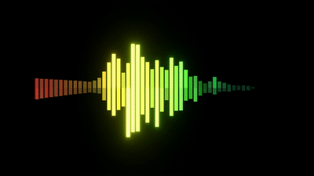

# Spectral Visualizer 

This is a spectral visualizer that analyzes the frequencies of music and sound, written in Godot 3.1. The bar's length and intensity depend on the amplitude of its corresponding frequency.



[Here's a video of it in action.](https://www.youtube.com/watch?v=7Ksw95gDI1c)

## Running

**Important: this requires [Godot 3.1 Alpha Mono edition](https://godotengine.org/article/dev-snapshot-godot-3-1-alpha-1). Older versions, such as Godot 3.0.x, will not work.**

Additionally, you need to install some packages using nuget. You can do this by [installing nuget if not yet installed](https://docs.microsoft.com/en-us/nuget/install-nuget-client-tools) and then running the following command in a terminal in the root of the project folder:

```
nuget restore
```

Then you can just open the project and run it as usual.

## How it works

The program uses the new Godot 3.1 API which enables you to get the raw byte array from an AudioStream, containing the entire audio file. The byte array is converted to an array of pairs of floats (since the sound is stereo) and then analyzed using MathNet's fourier transform functions. This is the main reason the program uses C# and not GDScript, since currently Godot does not expose any FFT functions to GDScript. Additionally, GDScript would probably be too slow.

Since Godot does not expose the position of the playback head of the stream, the program estimates the playback position by measuring the amount of time spent since the stream started and multiplying that by the sample rate. This works reasonably well, unless the playback is started/stopped regularly, which will cause the visualization to drift off in time compared to what you're seeing on the screen.

In the future I'd like this to work with an actual callback so you can get the stream of bytes in real-time, unfortunately this is not implemented in Godot yet. That would also enable visualization of audio captured in real time from e.g. a microphone.

## Music

The song is a cut-up version of Meterorite, a song that appears on my album [Meteorite Soundtrack](https://kenophos.bandcamp.com/album/meteorite-soundtrack).

## License

The code is licensed MIT. The song is released under the CC BY-SA 4.0 license.
